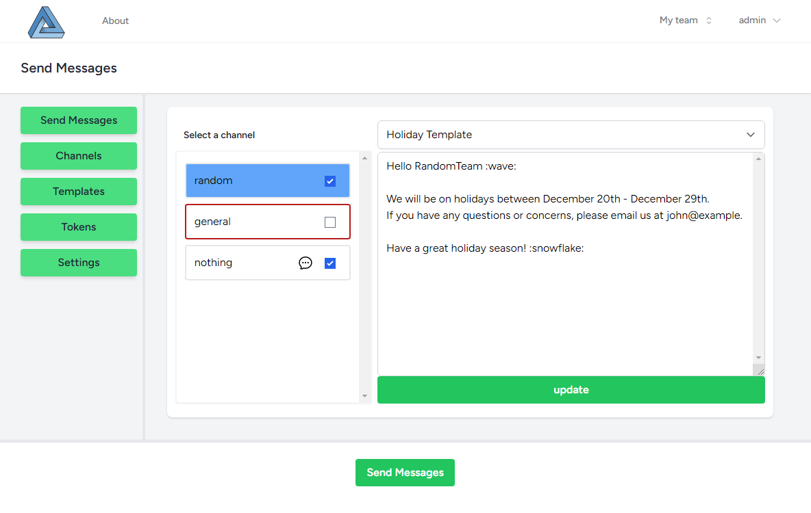

 &nbsp; 

# Slack Multichannel Send

This Laravel 10 project allows organizations to send multiple Slack messages to multiple channels at once using Slack tokens and message templates.




## Features

- Send multiple Slack messages to multiple channels at once
- Create and manage Slack message templates using tokens


## Requirements

- PHP 8.0+
- Composer 2.2+
- Node.js
- NPM
- MySQL
- Slack Workspace
- Slack App

## Configuration

### Slack Workspace

1. Create a Slack Workspace at https://slack.com/create
2. Create a Slack App at https://api.slack.com/apps
3. You will need to use either a User OAuth Token or Bot User OAuth Token to send messages to Slack channels. <br />
Both tokens can be accessed in the apps OAuth & Permissions page.
    
   ##### Users Tokens
   User OAuth Tokens allow you to post as the user who generated the token. Users can post to public and private channels.<br />
   <br />User Permissions needed:
    - `channels:read`
    - `chat:write`
    - `groups:read`
    - `im:read`
   <br /><br />     
   
   #### Bot User Tokens
   Bot User OAuth Tokens allow you to post as a bot user. Bots need to be invited to channels before they can post to them.<br />
   <br />Bot permissions needed:
    - `channels:read`
    - `chat:write`
    - `chat:write.customize`
    - `groups:read`
    - `im:read`
<br /><br />
4. Install the Slack App to your Slack Workspace

 

## Installation

1. Clone the repository to your local machine:

```shell
git clone https://github.com/mike1000000000/SlackMultiChannelSend.git
```
<br />

2. Install Composer dependencies:

```shell
cd SlackMultiChannelSend
composer install
```
<br />

3. Copy the `.env.example` file to `.env` and configure the required environment variables:

```shell
cp .env.example .env
```


>
> &nbsp;&nbsp;&nbsp;&nbsp;**NOTE**: Ensure you set your default user info and database credentials in the `.env` file.
>

<br />

4. Generate an application key: 

```shell
php artisan key:generate
```
<br />

5. Run migrations:

```shell
php artisan migrate
```
<br />

6. Seed default data:

```shell    
php artisan db:seed
```
<br />

7. Install NPM dependencies:

```shell
npm install
```
<br />

8. Compile assets:

```shell
npm run build
```
<br />

9. Start the local development server:

```shell
php artisan serve
```
<br />

You can now access the server at **http://localhost:8000**
<br /><br />Default credentials are: <br />

> <strong>u:</strong> javaria@example.com<br /> 
> <strong>p:</strong> javaria

## License

This project is open-sourced software licensed under the [MIT license](https://opensource.org/licenses/MIT).

## Credits

- [Laravel](https://laravel.com/)
  - [Laravel Jetstream](https://jetstream.laravel.com/1.x/introduction.html)
  - [Laravel Livewire](https://laravel-livewire.com/)
  - [Laravel Vite](https://vitejs.dev/)
- [Tailwind CSS](https://tailwindcss.com/)
- [Alpine.js](https://alpinejs.dev/)
- [JoliCode Slack PHP API](https://jolicode.com/slack-php-api)
- [Slack API](https://api.slack.com/)

## Contributing

Contributions are welcome.
